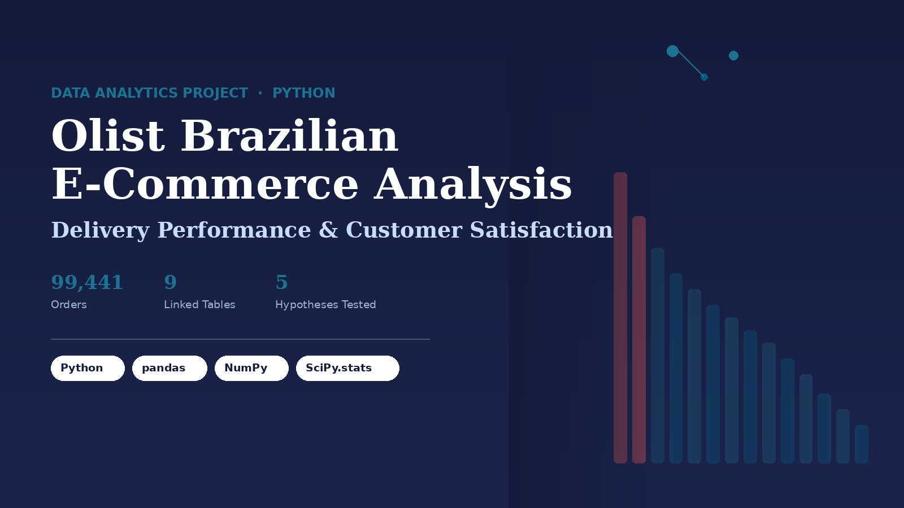
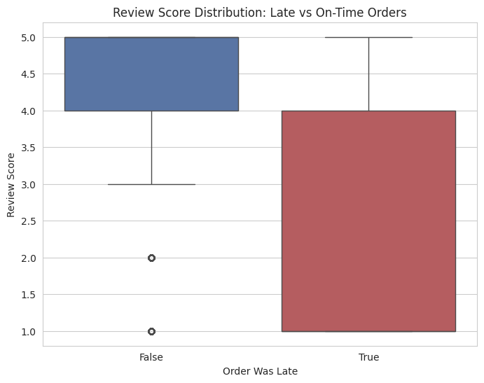
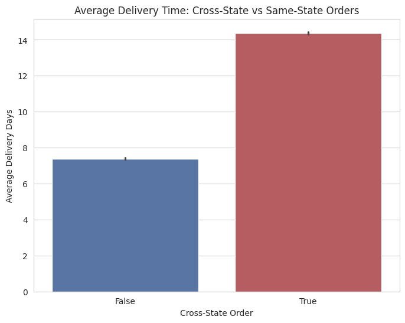
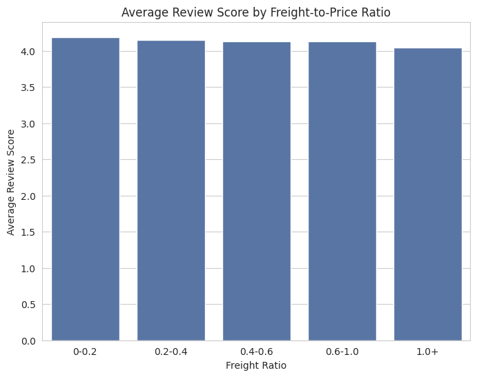
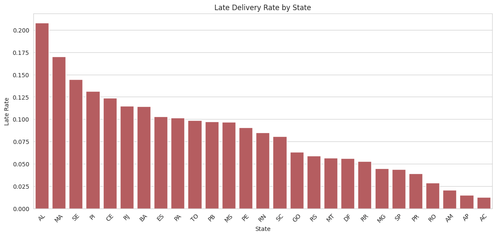
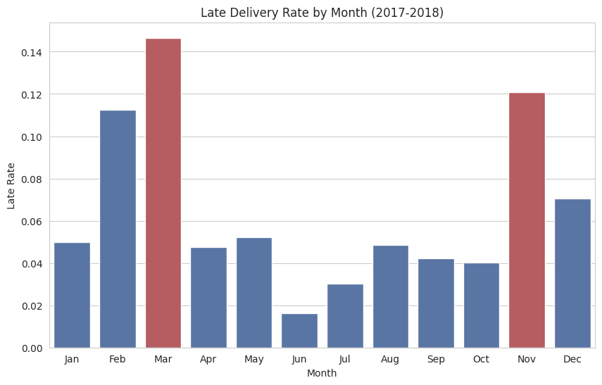
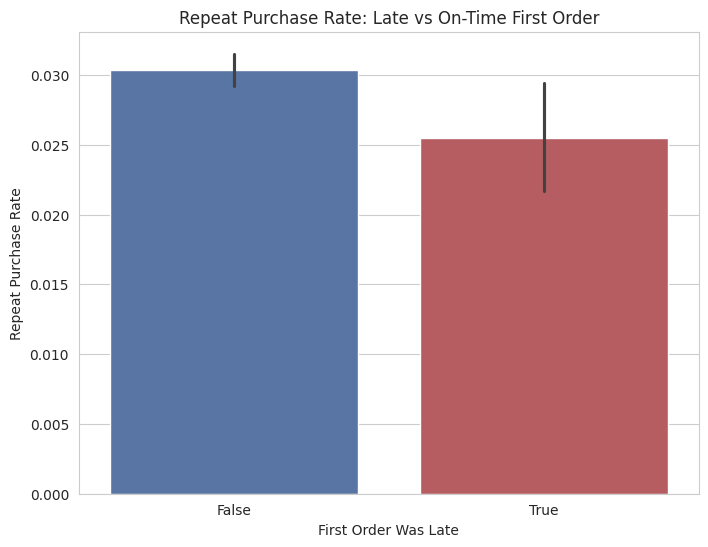

# Olist Brazilian E-Commerce: Delivery Performance & Customer Satisfaction Analysis



An end-to-end Python data analytics project that quantifies how delivery delays, distance, and seller performance drive customer reviews and repeat purchases on Olist, a Brazilian e-commerce platform. Built with pandas, NumPy, Matplotlib, Seaborn, and SciPy, using formal hypothesis testing rather than charts alone.

**[Read the full PDF report](./Olist_Full_Project_Report.pdf)**  ·  **[View the notebook](./Olist_Brazilian_E_Commerce_Delivery_Performance_and_Customer_Satisfaction_Analysis.ipynb)**

---

## Business Problem

Olist connects small and medium sellers across Brazil to major online marketplaces. Some deliveries arrive well past their estimated date, but it was unclear how much that actually hurts customer satisfaction, or which sellers, states, and time periods are most responsible.

This project quantifies that impact and identifies exactly where Olist should act first, using hypothesis testing instead of charts and gut feel.

## Key Results

| Metric | Finding |
|---|---|
| Review score impact | Late orders average **2.28 / 5** vs **4.29 / 5** for on-time orders (p < 0.001) |
| Delivery time impact | Cross-state orders take **14.4 days** vs **7.4 days** for same-state orders (p < 0.001) |
| Geographic spread | Late rates range from **1.3%** (Acre) to **20.8%** (Alagoas), a 16x spread |
| Seller concentration | Worst seller has a **50% late rate**, about 8x the platform average of 6.5% |
| Seasonality | **March (14.7%)** has a higher late rate than the Black Friday month of **November (12.1%)** |
| Retention impact | A late first order lowers repeat purchase rate from **3.03% to 2.55%** (borderline significant) |

## Dataset

[Brazilian E-Commerce Public Dataset by Olist](https://www.kaggle.com/datasets/olistbr/brazilian-ecommerce) (Kaggle), covering real orders placed between 2016 and 2018.

| Table | Rows | Used for |
|---|---|---|
| Orders | 99,441 | Core order dates and status |
| Order Items | 112,650 | Price, freight value |
| Order Reviews | 98,673 | Review score (1 to 5) |
| Customers | 93,071 unique | Customer state, repeat purchase tracking |
| Sellers | 2,967 unique | Seller state, seller performance ranking |
| Products, Category Translation, Payments, Geolocation | | Supporting joins |

After cleaning (removing non-delivered orders, 8 rows with missing delivery dates, and 288 extreme-outlier deliveries over 60 days), the analysis-ready dataset contains **96,182 orders across 21 engineered columns**.

## Tech Stack

`Python` `pandas` `NumPy` `Matplotlib` `Seaborn` `SciPy.stats`

## Methodology

1. **Data cleaning:** loaded and merged all 9 raw tables, converted timestamps, audited for duplicates and logic errors, filtered to delivered orders, removed 8 inconsistent rows and 288 extreme delivery-time outliers.
2. **Feature engineering:** `delivery_days`, `delay_days`, `is_late`, `cross_state`, `freight_ratio`, `purchase_month`, repeat-customer flags, and more, all built with pandas `groupby`/`merge` pipelines.
3. **Hypothesis testing:** each of the 5 hypotheses (6 tests, since H4 splits into state and month) was tested with the statistical method suited to its data shape, not just visualized.
4. **Validation:** a 1,000-resample bootstrap confidence interval was used to confirm the stability of the headline H1 finding, and minimum sample-size thresholds were applied before ranking states and sellers, to avoid small-sample noise.

```python
df = orders.merge(items_order_info, on="order_id")
df["delay_days"] = (df["delivered_date"] - df["estimated_date"]).dt.days
df["is_late"] = df["delay_days"] > 0

stats.mannwhitneyu(late_scores, ontime_scores, alternative="less")
# U = 99,223,042.5   p < 0.001   95% CI: 1.98-2.05
```

## Hypotheses & Results

| # | Hypothesis | Test Used | Result | Verdict |
|---|---|---|---|---|
| H1 | Late orders receive lower review scores than on-time orders | Mann-Whitney U | 2.28 vs 4.29 avg score, p < 0.001 | **Supported** (strong) |
| H2 | Cross-state orders take longer to deliver than same-state orders | Mann-Whitney U | 14.4 vs 7.4 avg days, p < 0.001 | **Supported** (strong) |
| H3 | Higher freight-to-price ratio is linked to lower review scores | Spearman correlation | rho = -0.031, p < 0.001 | Weakly supported (negligible effect) |
| H4a | Late delivery rates differ significantly across states | Chi-square | chi2 = 1,611.4, p < 0.001 | **Supported** (strong) |
| H4b | Late delivery rates peak around Black Friday (November) | Chi-square | chi2 = 2,503.2, p < 0.001; March (14.7%) > Nov (12.1%) | Partially supported |
| H5 | A late first order reduces the chance of a repeat purchase | Chi-square | chi2 = 4.37, p = 0.037 | Weakly supported (borderline) |

## Visualizations

<table>
<tr>
<td width="50%">

**H1: Late Delivery vs. Review Score**


</td>
<td width="50%">

**H2: Cross-State Delivery Time**


</td>
</tr>
<tr>
<td width="50%">

**H3: Freight Ratio vs. Review Score**


</td>
<td width="50%">

**H4a: Late Rate by State**


</td>
</tr>
<tr>
<td width="50%">

**H4b: Late Rate by Month**


</td>
<td width="50%">

**H5: Repeat Purchase Rate**


</td>
</tr>
</table>

## Additional Analysis: Seller Performance

Among 880 sellers with a reliable order volume (20+ items), late rates ranged from near 0% up to 50%, pointing to a small group of repeat offenders rather than a platform-wide problem. Full ranking and methodology in the [PDF report](./Olist_Full_Project_Report.pdf).

## Recommendations

1. **Set distance-based delivery estimates** instead of a flat platform-wide default.
2. **Prioritize logistics fixes in the Northeast**, especially Alagoas (20.8% late) and Maranhao (17.0% late).
3. **Audit the small group of consistently underperforming sellers** (up to 50% late rate).
4. **Investigate March specifically**, not just the Black Friday month of November.
5. **Don't over-invest in freight-cost discounts**; the effect on satisfaction is negligible. Delivery speed is the stronger lever.

## Limitations

- Findings describe correlation, not proven causation.
- The dataset covers 2016 to 2018 only; Olist's logistics network has likely changed since.
- Review scores can reflect factors beyond delivery (product quality, seller communication).
- Small-sample states and sellers were flagged, but not excluded, interpret low-volume outliers with caution.

Full discussion in the [PDF report](./Olist_Full_Project_Report.pdf).

## Repository Structure

```
.
├── README.md
├── Olist_Full_Project_Report.pdf                     # 17-page detailed report
├── Olist_Brazilian_E_Commerce_Delivery_Performance_and_Customer_Satisfaction_Analysis.ipynb
└── assets/                                            # Chart images used in this README
```

## How to Reproduce

1. Download the dataset from [Kaggle](https://www.kaggle.com/datasets/olistbr/brazilian-ecommerce) and place the CSVs in a `data/` folder.
2. Open the notebook in Jupyter or Google Colab.
3. Run all cells top to bottom.

```bash
pip install pandas numpy matplotlib seaborn scipy
```

## Author

**Jobyar Ahmed**
Data Operations Analyst, Dhaka, Bangladesh
[GitHub](https://github.com/jobyarahmedudoy) · [Portfolio](https://jobyarahmedudoy.github.io/jobyarahmedudoy.insightlab.io/)
